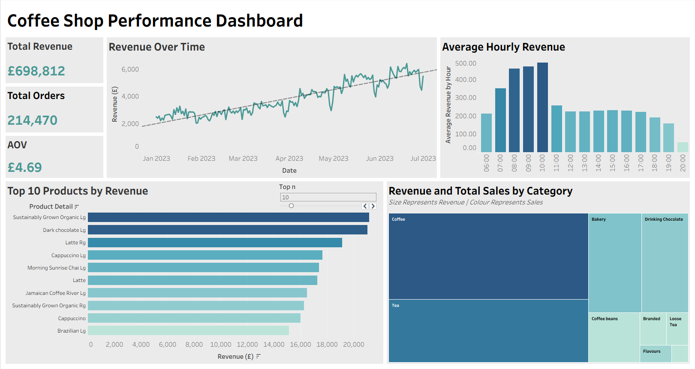

# Coffee Shop Performance Analysis

## Project Overview
This project looks to understand the performance of a coffee shop. The data used spans from January to July 2023.

I began by exploring the dataset using SQL to understand its structure and key metrics, including revenue trends, product performance and average order value.

The insights from this analysis informed the design of the Tableau dashboard, ensuring the visualisations effectively represent the data and addressed the business questions. Key performance indicators were then incorporated to provide a clear summary of performance.

## Business Questions
1. What are the daily revenue trends?

2. What are the top-10 best selling products?

3. What are the top 5 items per category by revenue?

4. What is the overall average order value?

## Key Insights

- Peak sales occur in the morning.

- Products within the coffee category drive the majority of revenue.

- Revenue has an upward trend over time, signifying positive business growth.

## Dashboard

*Image of the dashboard from Tableau*

### Here is a link to this dashboard:
[Dashboard on Tableau Public](https://public.tableau.com/app/profile/tim.anderson5782/viz/CoffeeShopPerformanceAnalysis/Dashboard1?publish=yes)

## SQL Analysis
### I want to show my queries and their outputs so that you understand the process I have taken to reach my final analysis.

### Hourly Average Revenue:
```sql 
SELECT
    time_of_day,
    ROUND(AVG(hourly_revenue), 2) AS avg_revenue
FROM (
    SELECT
        transaction_date,
        time_of_day,
        SUM(revenue) AS hourly_revenue
    FROM (
        SELECT
            transaction_date,
            EXTRACT(HOUR FROM transaction_time) AS time_of_day,
            transaction_qty * unit_price AS revenue
        FROM
            coffee_data
    )
    GROUP BY
        time_of_day,
        transaction_date
    ORDER BY
        transaction_date,
        time_of_day
)
GROUP BY
    time_of_day
ORDER BY
    time_of_day;
```

**Query insight:**
This query groups revenue by the hour of the day, allowing identification of peak hours for sales. These insights can inform staffing decisions and operational planning to maximise efficiency during high-demand hours and improve customer satisfaction.

**Query output:**
| Hour | Average Revenue (£) |
|------|--------------------|
| 06:00 | 210.58 |
| 07:00 | 350.97 |
| 08:00 | 456.91 |
| 09:00 | 470.55 |
| 10:00 | 489.91 |
| 11:00 | 255.91 |
| 12:00 | 222.06 |
| 13:00 | 223.02 |
| 14:00 | 228.20 |
| 15:00 | 230.57 |
| 16:00 | 227.20 |
| 17:00 | 221.74 |
| 18:00 | 189.43 |
| 19:00 | 157.16 |
| 20:00 | 53.38 |

**Key Insight:**

Peak revenue occurs between 08:00 and 10:00, with a noticeable decline after 11:00. This indicates a strong morning demand.

### Top 10 Best Selling Products:
```sql
SELECT
    product_detail,
    SUM(transaction_qty) AS no_of_sales
FROM
    coffee_data
GROUP BY
    product_detail
ORDER BY
    no_of_sales DESC
LIMIT
    10;
```

**Query insight:**
This query pinpoints the top-performing products by volume, spotlighting items that outperform the others, as well as the extent of their contribution. These insights inform stock purchasing and support marketing and promotional strategies to maximise overall revenue.

**Query output:**
| Product Detail                     | No. of Sales |
|----------------------------------|--------------|
| Earl Grey Rg                     | 4708         |
| Dark chocolate Lg                | 4668         |
| Morning Sunrise Chai Rg          | 4643         |
| Latte                            | 4602         |
| Peppermint Rg                    | 4564         |
| Columbian Medium Roast Rg        | 4547         |
| Traditional Blend Chai Rg        | 4512         |
| Latte Rg                         | 4497         |
| Our Old Time Diner Blend Sm      | 4484         |
| Serenity Green Tea Rg            | 4477         |

**Quick insight:**

The top 10 products show very similar sales volumes, suggesting that demand is spread across a range of items rather than concentrated on a few products.

### Top 5 Items per Category by Revenue:
```sql
SELECT
    product_category,
    product_detail AS product_name,
    total_revenue,
    revenue_rank
FROM (
    SELECT
        product_category,
        product_detail,
        SUM(transaction_qty * unit_price) AS total_revenue,
        RANK() OVER(
            PARTITION BY product_category
            ORDER BY SUM(transaction_qty * unit_price) DESC
        ) AS revenue_rank
    FROM
        coffee_data
    GROUP BY
        product_detail,
        product_category
)
WHERE
    revenue_rank <= 5;
```

**Query insight:**
This query displays the products that generate the most revenue for each category, showcasing not only the top performers but also how performance varies across categories. These insights enable accurate resource allocation and allow for review of underperforming products to improve efficiency and profitability.

**Query output:**
| Product Category      | Product Name                         | Total Revenue | Revenue Rank |
|----------------------|--------------------------------------|---------------|--------------|
| Bakery               | Chocolate Croissant                  | 11625.98      | 1            |
| Bakery               | Scottish Cream Scone                 | 8949.45       | 2            |
| Bakery               | Ginger Scone                         | 8011.61       | 3            |
| Bakery               | Jumbo Savory Scone                   | 7626.62       | 4            |
| Bakery               | Almond Croissant                     | 7168.13       | 5            |
| Branded              | I Need My Bean! T-shirt              | 6163          | 1            |
| Branded              | I Need My Bean! Latte cup            | 4509          | 2            |
| Branded              | I Need My Bean! Diner mug            | 2935          | 3            |
| Coffee               | Latte Rg                             | 19112.25      | 1            |
| Coffee               | Cappuccino Lg                        | 17641.75      | 2            |
| Coffee               | Latte                                | 17257.50      | 3            |
| Coffee               | Jamaican Coffee River Lg             | 16481.25      | 4            |
| Coffee               | Cappuccino                           | 15997.50      | 5            |
| Coffee beans         | Civet Cat                            | 11700         | 1            |
| Coffee beans         | Organic Decaf Blend                  | 4657.5        | 2            |
| Coffee beans         | Ethiopia                             | 4578          | 3            |
| Coffee beans         | Brazilian - Organic                  | 3852          | 4            |
| Coffee beans         | Our Old Time Diner Blend             | 3294          | 5            |
| Drinking Chocolate   | Sustainably Grown Organic Lg         | 21151.75      | 1            |
| Drinking Chocolate   | Dark chocolate Lg                    | 21006.0       | 2            |
| Drinking Chocolate   | Sustainably Grown Organic Rg         | 16233.75      | 3            |
| Drinking Chocolate   | Dark chocolate Rg                    | 14024.5       | 4            |
| Flavours             | Sugar Free Vanilla syrup             | 2324.0        | 1            |
| Flavours             | Chocolate syrup                      | 2126.4        | 2            |
| Flavours             | Carmel syrup                         | 2060.8        | 3            |
| Flavours             | Hazelnut syrup                       | 1897.6        | 4            |
| Loose Tea            | Morning Sunrise Chai                 | 1596.0        | 1            |
| Loose Tea            | Serenity Green Tea                   | 1470.75       | 2            |
| Loose Tea            | English Breakfast                    | 1440.95       | 3            |
| Loose Tea            | Peppermint                           | 1369.35       | 4            |
| Loose Tea            | Traditional Blend Chai               | 1369.35       | 4            |
| Packaged Chocolate   | Chili Mayan                          | 1972.84       | 1            |
| Packaged Chocolate   | Sustainably Grown Organic            | 1679.6        | 2            |
| Packaged Chocolate   | Dark chocolate                       | 755.2         | 3            |
| Tea                  | Morning Sunrise Chai Lg              | 17384         | 1            |
| Tea                  | Spicy Eye Opener Chai Lg             | 13652.4       | 2            |
| Tea                  | Peppermint Lg                        | 13050         | 3            |
| Tea                  | English Breakfast Lg                 | 12927         | 4            |
| Tea                  | Earl Grey Lg                         | 12735         | 5            |

**Quick insight:**

There is a clear revenue disparity between categories. We can see the core drink categories, such as tea, coffee and drinking chocolate, generate a large portion of revenue, highlighting that they are key drivers of the business.

### Average Order Value:
```sql
SELECT
    ROUND(AVG(transaction_qty * unit_price), 2) AS average_order_value
FROM
    coffee_data
```

**Query insight:**
This query aggregates all orders to calculate average order value, revealing customer spend per transaction. This insight provides an understanding of customer behaviour, and encourages further analysis of how we sell products. It supports strategies such as product bundling, upselling and promotional offers to increase overall revenue.

**Query output:**
| Average Order Value |
|---------------------|
| 4.69                |

**Quick insight:**

This result indicates that customer spend per transaction is relatively low, suggesting many transactions may consist of a single product.

## Recommendations

### Peak Sales Hours
- Increase staffing during peak hours (08:00-10:00) to improve service efficiency and reduce customer waiting times.
- Ensure adequate stock-on-hand levels and operational readiness for these high-demand periods.

### Top-Performing Products
- Prioritise high-revenue items when managing inventory to guarantee availability.
- Focus marketing efforts on these products to drive further revenue growth.

### Category Performance
- Allocate resources to high-performing categories.
- Review underperforming products for potential discontinuation or improvement.

### Average Order Value
- Create product bundle deals to increase spend per transaction (e.g. a food and drink combination).
- Train staff on upselling techniques to encourage additional purchases at checkout.
